# 🌐 Web-Based Electronic Vital Event Registration System  

A **modern web application** that allows citizens to register vital events (birth, marriage, death, etc.) electronically and enables administrators to manage and verify records efficiently.  
This system is designed to **improve accessibility, reduce paperwork, and enhance transparency** in vital event management.  

---

## 🚀 Features  

- 📝 **Electronic Event Registration** – Citizens can register events online.  
- 🔐 **Secure Login System** – Separate access for Admins and Users.  
- 📊 **Admin Dashboard** – Manage registrations and monitor statistics.  
- 👥 **User Management** – Control registered accounts and permissions.  
- 📑 **Report Generation** – Generate event reports easily.  
- ✅ **Approval Status Tracking** – Citizens can check the approval status of their applications.  

---

## 🛠️ Technologies Used  

- **Frontend:** HTML, CSS, JavaScript
- **Backend:** Flask 
- **Database:** MySQL 
- **Other Tools:** Bootstrap 

---

## 📂 Project Demo

---

## 📸 Screenshots  

### 🏠 Landing Page  
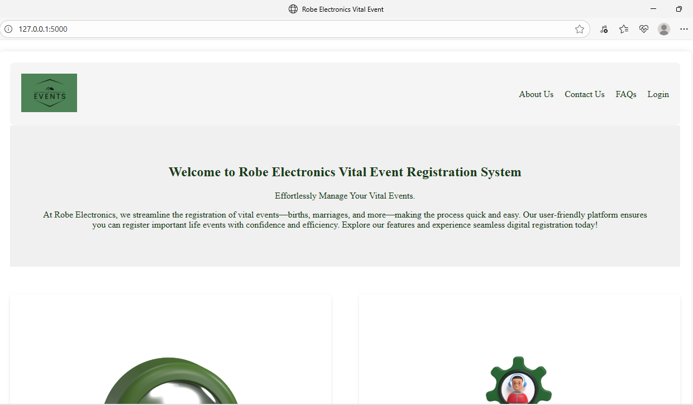  
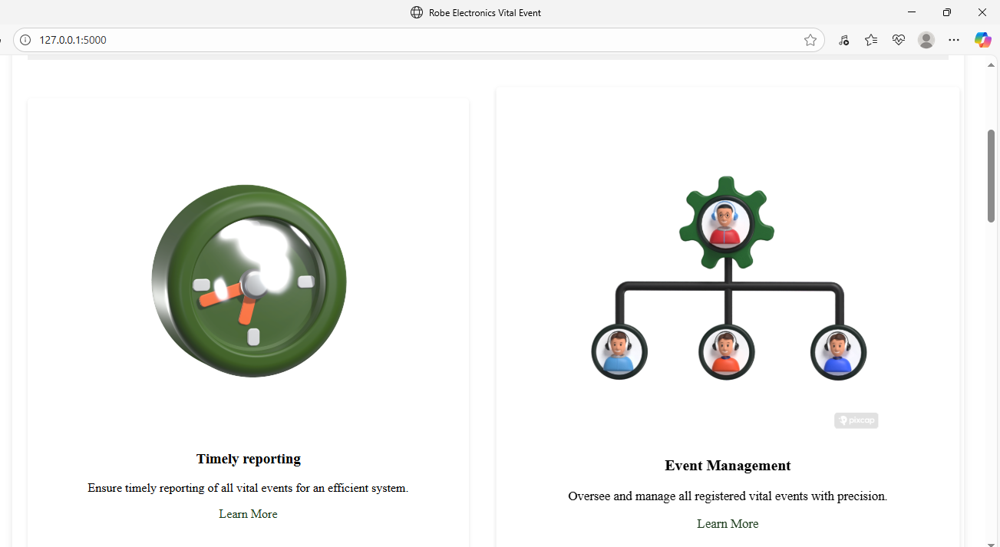  
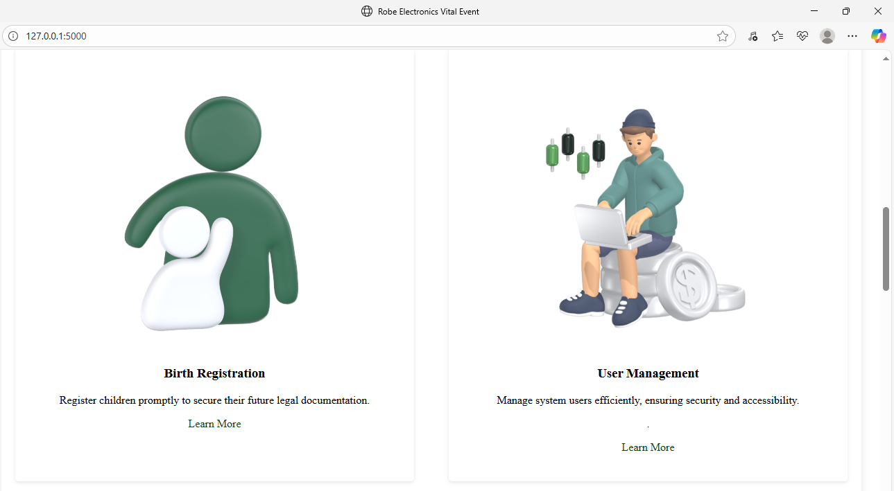  

### 🔐 Login Page  
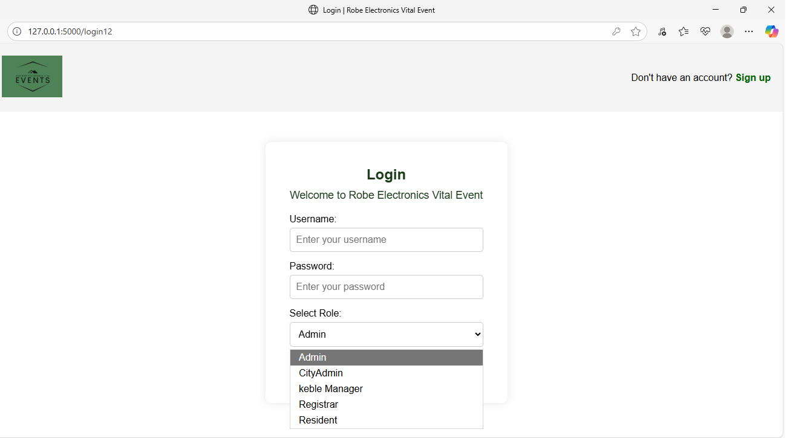  

### 📊 Admin Dashboard  
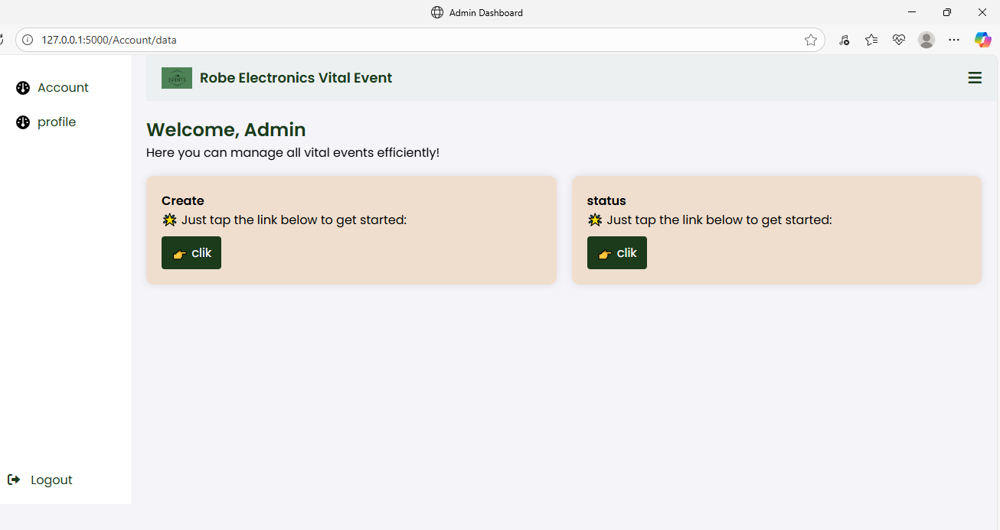  

### 👥 User & Account Management  
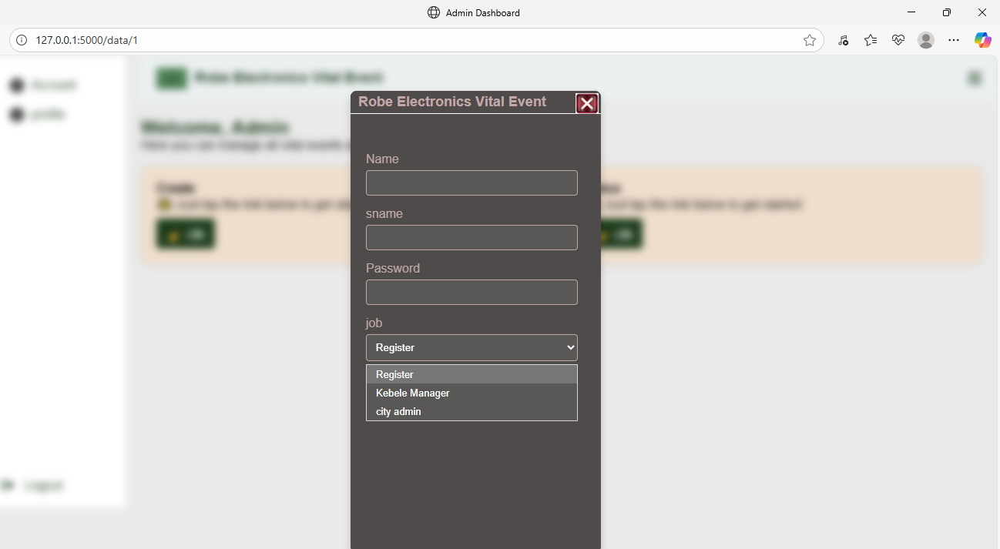  
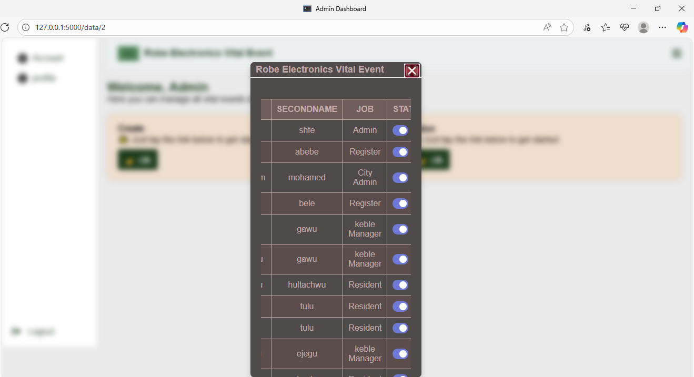  
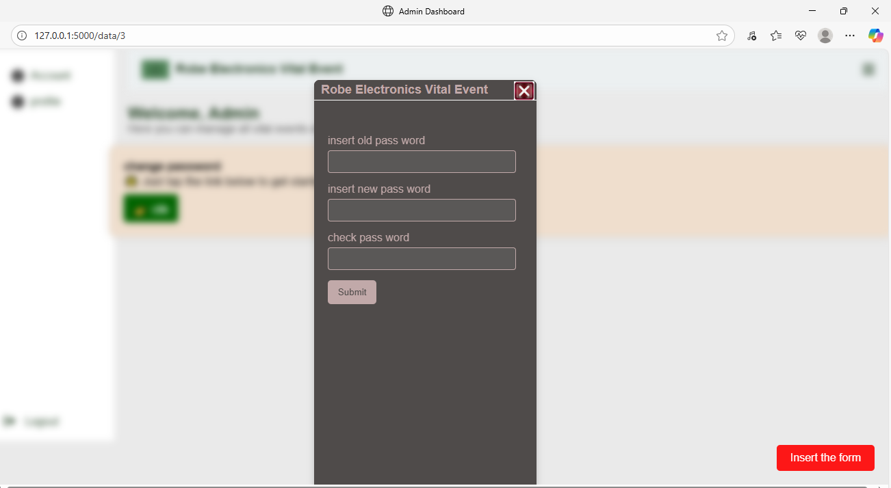  

### 📝 Register Event Data  
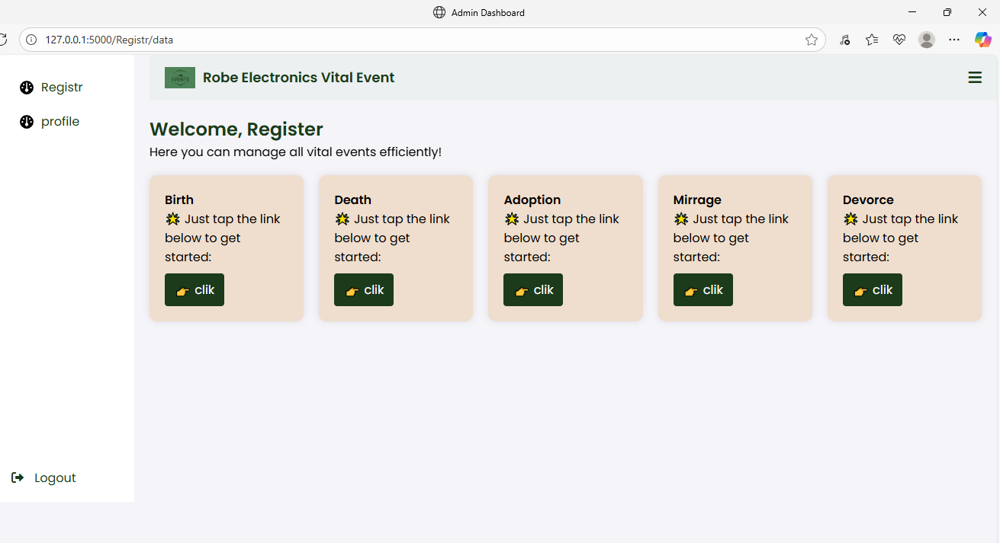  

### 📑 Reports & Approval  
  
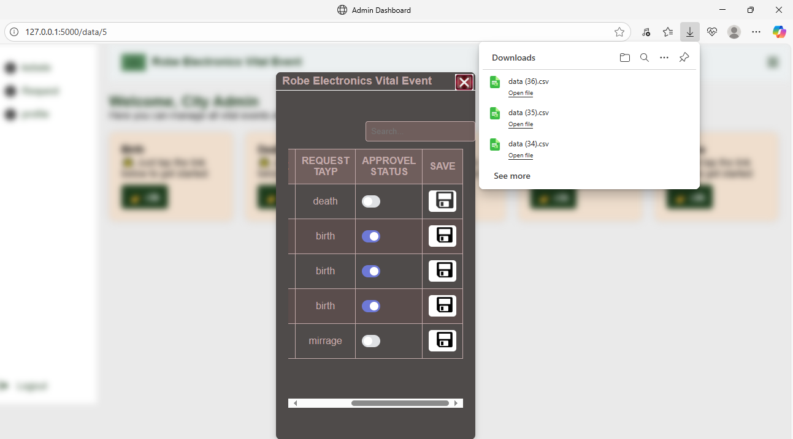  
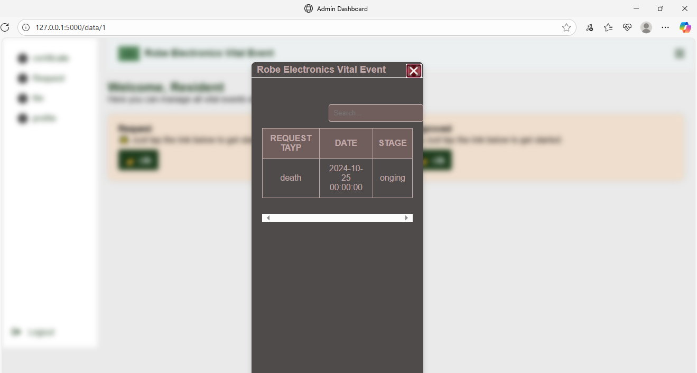  

---

## ⚙️ Installation  

1. Clone the repository:  
   ```bash
   git clone https://github.com/Samson-Abebe/vital-event-registration.git  
   cd web_based_electronic_vital_event_registration_system


## 🛠️ Important Setup Note

When adding the **admin user manually** into the `emp` table,  
make sure to set their **job_id = 1**.  
This ensures the system recognizes them as an administrator.


